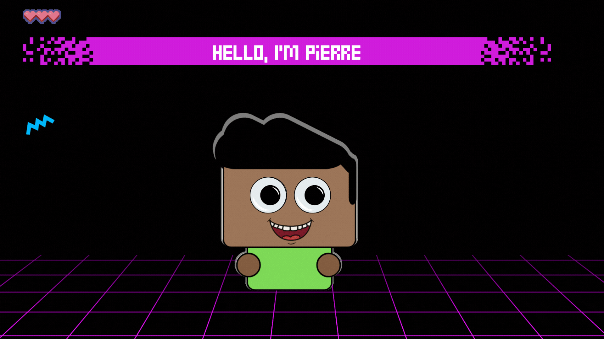
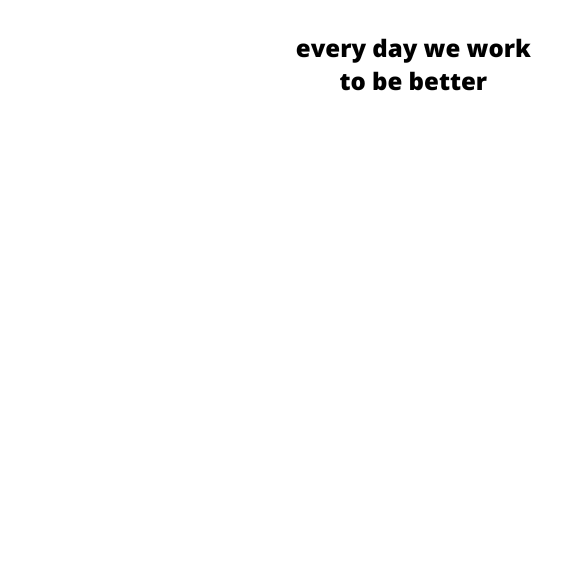

<h1 align="center">¡yes! the character above is me</h1>  
<h3 align="center">A passionate frontend developer from México.</h3>

- 🌱 I’m currently learning **React-redux**

- 👨‍💻 All of my projects are available at [MY Portfolio](https://github.com/PierreBarba?tab=repositories)

- 📫 How to reach me **magpe02@hotmail.com**

- 💼 I am open to new job opportunities.

<!-- - 📄 Know about my experiences [My Resume](https://iqbal-elham.onrender.com/static/media/Mohammad_Iqbal_CV.5fb3ae9d11100998e5c2.pdf)

<!-- 
  

-->
 
<h2 align="left">Connect with me:</h2>

 

<h2 align="left">Languages and Tools:</h2>
 

        <a href="https://jestjs.io" target="_blank" rel="noreferrer">    </a>       <a href="https://rubyonrails.org" target="_blank" rel="noreferrer">    </a>         

  

  
